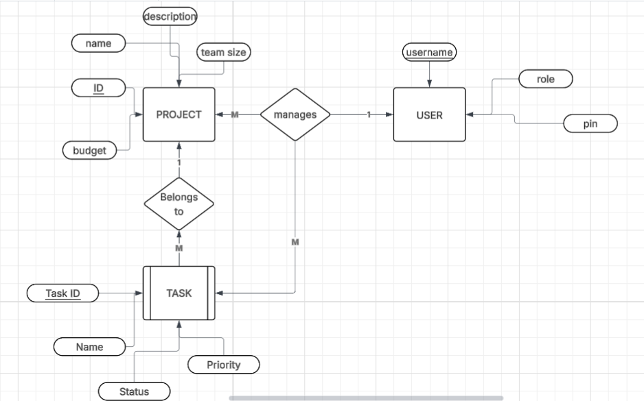
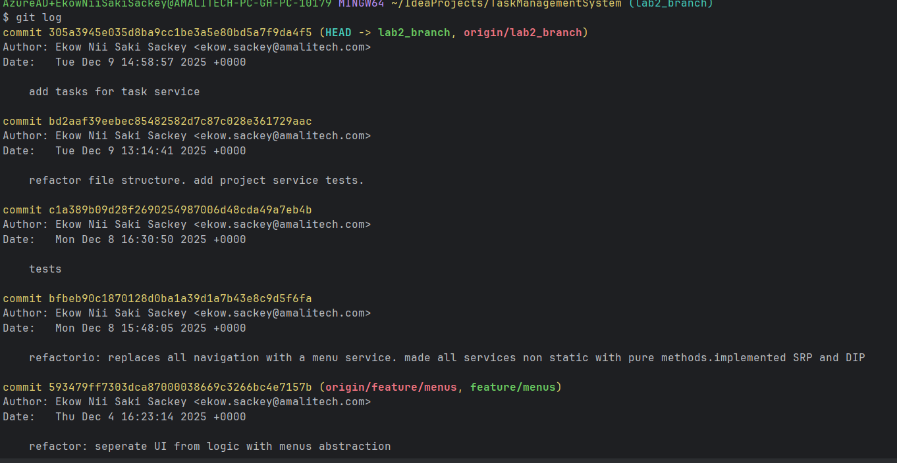

# Task Manager CLI

**Task Manager CLI** is a command-line project and task management system built in Java. It helps users efficiently organize, track, and manage their projects and tasks directly from the terminal. This tool is ideal for developers, students, and anyone who prefers a CLI-based workflow for productivity.

## Feature Summary

- Users can add software or hardware projects after signing in.
- Users can organize tasks within projects.
- Users can mark tasks as completed, started or pending
- Users can can update task priority 
- Users can search projects by budget range
- Simple, intuitive command syntax



## Installation

### Requirements

- Java 21 (LTS) 

### Build from source

```bash
git clone https://github.com/EkowSackey/Task-Manager-CLI.git
cd Task-Manager-CLI
javac -d bin src/*.java
# Run the CLI 
java -cp bin Main
```


## Usage
Follow the intuitive console UI commands to use. 


## Contributing

Contributions, bug reports, and feature requests are welcome!

1. Fork the repository
2. Create your feature branch (`git checkout -b feature/your-feature`)
3. Commit your changes (`git commit -am 'Add feature'`)
4. Push to the branch (`git push origin feature/your-feature`)
5. Create a new Pull Request


## Author

Ekow Sackey

## Commit Log Snapshot


